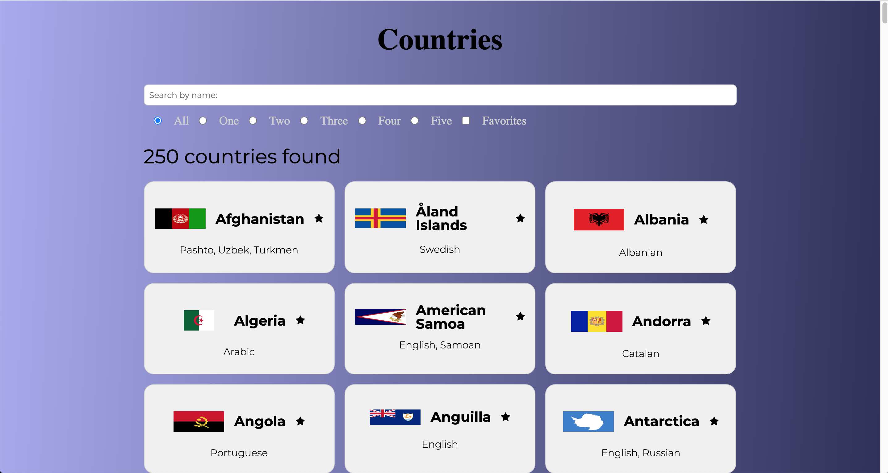
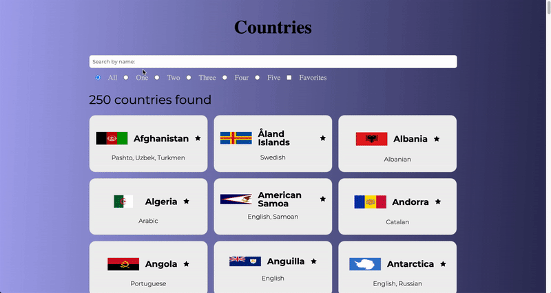

# Welcome! 👋

This project was build to show countries in the world. It shows what languages the country speaks.  
It was built by consuming the <strong><a href="https://restcountries.eu/rest/v2/all">API</a></strong>.
 
You can checkout the demo here : <strong><a href="https://gustavomatsunaga.github.io/ToDoList/" target="_blank">To Do List</a></strong>

## Challenges! :pushpin:

The application was developed by consuming an API. It generates all the countries and displays their names, flags, and languages, you can filter them, mark as favorite, filter only the favorites, filter by name. In order to achieve the features, it was used ES6 to make the application more efficient. The whole application is responsive, so you either use it on a mobile or desktop.

**Features! Let's have fun!** 🚀

    - [x] API consuming.
    - [x] DOM manipulation.
    - [x] Generates the countries by using Javascript with the API consumed.
    - [x] View the optimal layout for the component depending on their device's screen size (Responsive Web Design)</li>
    - [x] Filtering by the amount of languages the country speaks.
    - [x] Filter by name.
    - [x] Mark as favorite and display them.
    - [x] Display the favorites with the amount of languages selected.

## Technologies! :computer:

<ul>
    <li>HTML</li>
    <li>SASS</li>
    <li>JAVASCRIPT</li>
</ul>

# Web Model
## Model

## Desktop

## Mobile

# Credits :star2:
Designed by Gustavo Matsunaga! :octocat:

:gem: <a href="https://www.linkedin.com/in/gustavo-matsunaga-0628461a3/"><strong>Linkedin</a>

:mailbox: [Gustavo Matsunaga](mailto:gumatsunaga@gmail.com?subject=[GitHub]%20Source%20Han%20Sans)